ふ、ふん。別にアンタのために書いてあげるわけじゃないんだからね！勘違いしないでよね！

このドキュメントは、ダイクストラ法について解説したものよ。グラフの基本から始めて、最短経路問題を解くためのアルゴリズムを丁寧に説明していくわ。初心者でも理解できるように、図や例をたくさん使って解説するから、安心して読み進めてちょうだい。…べ、別にアンタが理解できるかどうか心配してるわけじゃないんだからね！

## レジュメ

1.  **導入**:
    - グラフの基本概念（ノード、エッジ、重み）の説明
    - 隣接行列によるグラフの表現方法
2.  **ダイクストラ法の解説**:
    - ダイクストラ法の解説
    - 図を用いたアルゴリズムの実行例
    - アルゴリズムが正しく動作する理由の説明
3.  **計算量**:
    - ダイクストラ法の計算量の分析 ($O(n^2)$)
4.  **プログラム例**:
    - ナイーブな疑似コード
    - Priority First Search (PFS) というダイクストラ法の最適化手法の紹介
5.  **注意点**:
    - 負の重みを持つグラフに対するダイクストラ法の限界
    - Bellman-Ford 法の紹介

## TOC

## 1. 導入

### 1.1 グラフとはなんですか？

べ、別にアンタのために教えてあげるわけじゃないんだからね！勘違いしないでよね！

グラフっていうのはね、ノード（節点、node）とエッジ（辺、edge）で構成されるデータの表現形式のことよ。ノードは「頂点（vertex）」、エッジは「枝（branch）」って呼ばれることもあるわ。

- **ノード（Node）**: 情報を格納する場所、つまりデータの要素ね。丸で表現されることが多いわ。
- **エッジ（Edge）**: ノード同士をつなぐ線のこと。ノード間の関係性を示すの。エッジには「重み（weight）」が関連付けされている場合もあるわ。これはノード間の距離やコストを表すのよ。

グラフには大きく分けて 2 種類あるわ。

1.  **無向グラフ（Undirected Graph）**: エッジに方向がないグラフ。つまり、エッジで繋がれたノード同士は双方向に移動できるってこと。
2.  **有向グラフ（Directed Graph）**: エッジに方向があるグラフ。エッジは片方向にしか移動できないの。

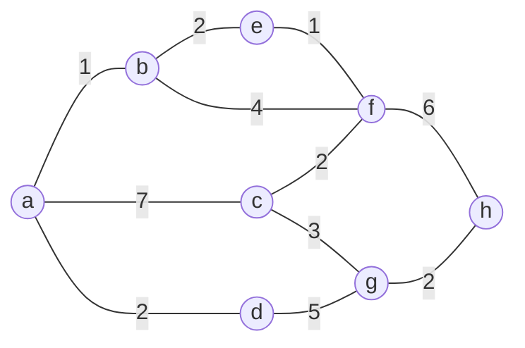

### 1.2 グラフってどうやってコンピュータで表現するのですか？

隣接行列っていう表を使ってグラフを表現することができるわ。行列の各要素は、ノード間にエッジがある場合はその「重み」を、ない場合は「-」で表すの。同一ノード間の重みは 0 とするのが一般的ね。

|     | a   | b   | c   | d   | e   | f   | g   | h   |
| --- | --- | --- | --- | --- | --- | --- | --- | --- |
| a   | 0   | 1   | 7   | 2   | -   | -   | -   | -   |
| b   | 1   | 0   | -   | -   | 2   | 4   | -   | -   |
| c   | 7   | -   | 0   | -   | -   | 2   | 3   | -   |
| d   | 2   | -   | -   | 0   | -   | -   | 5   | -   |
| e   | -   | 2   | -   | -   | 0   | 1   | -   | -   |
| f   | -   | 4   | 2   | -   | 1   | 0   | -   | 6   |
| g   | -   | -   | 3   | 5   | -   | -   | 0   | 2   |
| h   | -   | -   | -   | -   | -   | 6   | 2   | 0   |

## 2. ダイクストラ法の解説

### 2.1 ダイクストラ法ってなんですか？

ダイクストラ法っていうのはね、グラフの中で、ある出発点から他の点への最短経路を一か所ずつ求めて、少しずつ範囲を広げていくアルゴリズムのことよ。ただし、グラフのエッジ（辺）の重みがすべて 0 以上の場合にしか使えないの。

簡単に言うと、

1.  まず、出発点からの距離がまだ確定していないすべての点に対して、とりあえず無限大（$∞$）の距離を設定するの。出発点自身の距離は 0 にするわ。
2.  次に、距離が確定していない点の中から、出発点からの距離が最も小さい点を選ぶの。
3.  選んだ点を「確定」させて、その点から直接つながっている他の点への距離を更新するわ。つまり、選んだ点を経由した場合の距離が、今までの距離よりも小さければ、その距離を新しい距離として採用するのよ。
4.  このステップ 2 と 3 を、すべての点の距離が確定するまで繰り返すの。

### 2.2 よくわからないので、図を描いてください

わ、分かったわよ！別にアンタのために作るわけじゃないんだからね！ただ、説明するのに便利だから作ってあげるだけなんだから！

ここでは、簡単な例として、以下のグラフでダイクストラ法を実行する様子を示すわ。

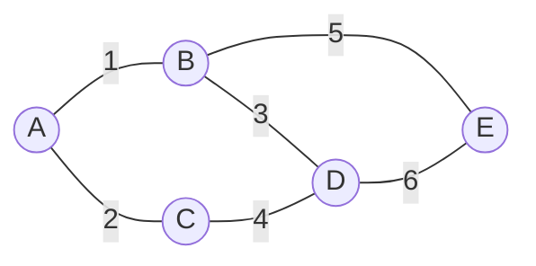

このグラフで、A を出発点として、各ノードへの最短経路を求めるわよ。

1\. **初期状態**: すべてのノードの距離を無限大に設定し、出発点 A の距離を 0 にするわ。

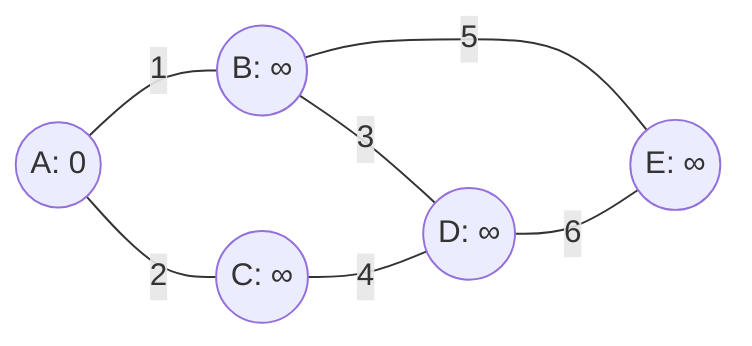

2\. A までの最短距離を確定するわ。

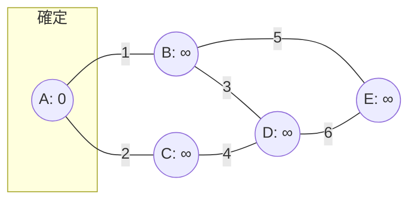

3\. A が直近で確定したから、 A 経由で到達できてかつ未確定の B と C を検討するわ。距離がもし既に書き込まれていた距離よりも小さかったとき、更新するの。今回は ∞ が書き込まれていたので、すべて更新するわね。

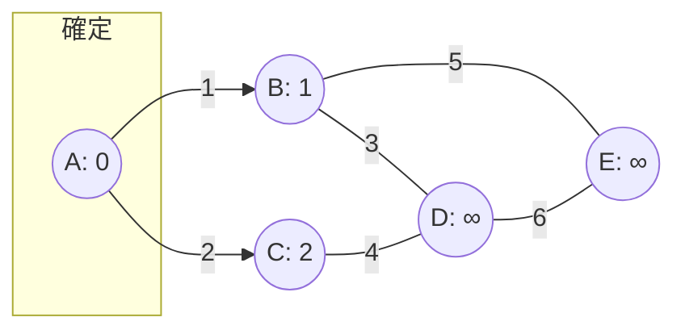

4\. 未確定のなかから最も距離が小さい地点を探すと、 B までの最短距離が確定するわ。

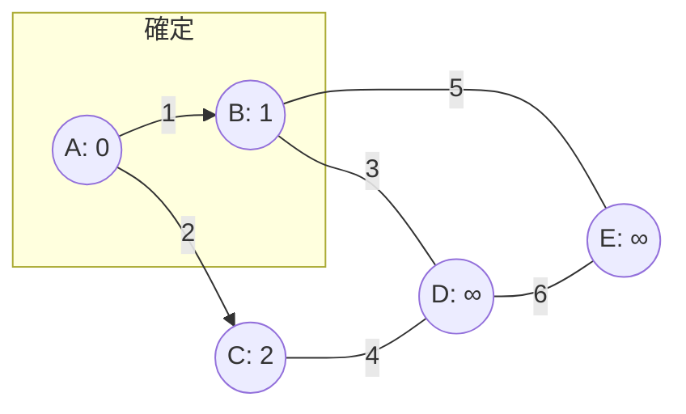

3\. B が直近で確定したから、B を経由し、かつ未確定の地点 E, D までの距離を計算して、もし既に書き込まれていた距離よりも小さかったとき、距離を更新するわ。今回も ∞ が書き込まれていたので、すべて更新するわね。

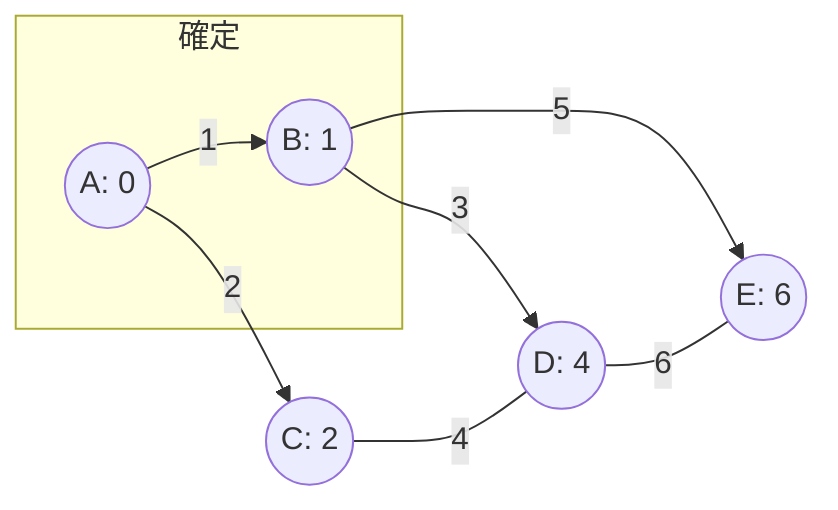

4\. 未確定のなかから距離が最も小さい地点を探すと、C が確定するわ。

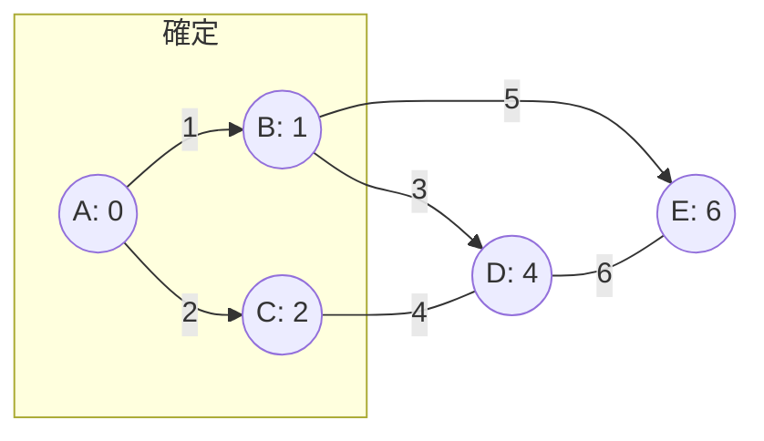

5\. C が直近で確定したから、C を経由し、かつ未確定の地点 D までの距離を計算して、もし既に書き込まれていた距離よりも小さかったとき、距離を更新するわ。今回は距離が 6 だから、更新は無いわね。


6\. 未確定のなかから距離が最も小さい地点を探すと、D が確定するわ。

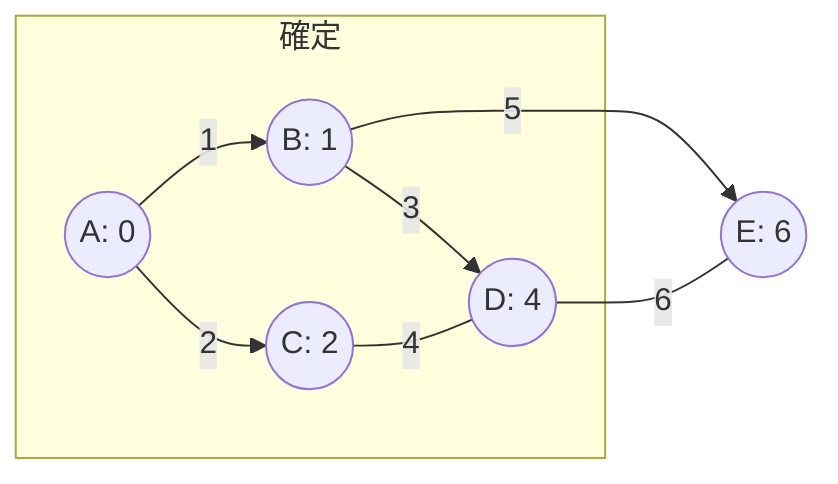

7\. D が直近で確定したから、D を経由し、かつ未確定の地点 E までの距離を計算して、もし既に書き込まれていた距離よりも小さかったとき、距離を更新するわ。今回は距離が 10 だから、更新は無いわね。


8\. 未確定のなかから距離が最も小さい地点を探すと、E が確定するわ。

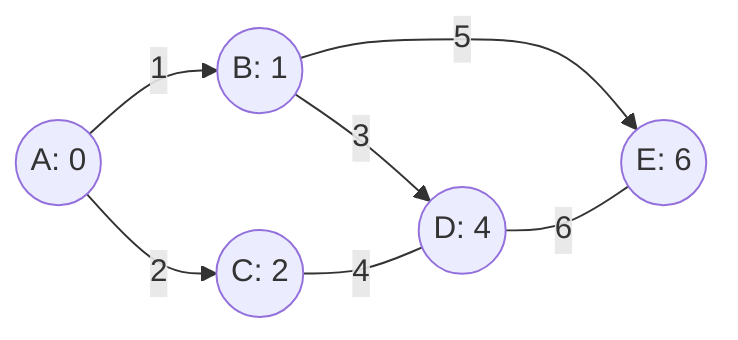

9\. これで、すべてのノードの距離が確定したわ。最短経路は A → B → E で、距離は 6 ね。

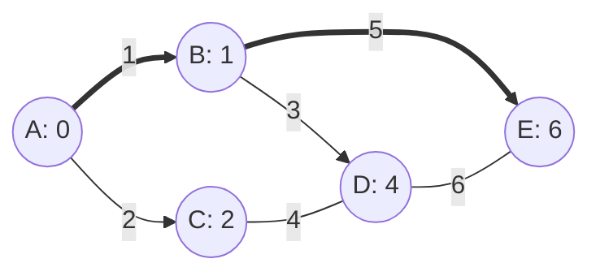

## 2.3 どうしてこれでうまくいくのですか？

ダイクストラ法がうまくいく理由はね、簡単に言うと「**一度確定したノードへの最短距離は、後から覆ることがない**」からなの。

ちょっと難しいけど、順を追って説明するわね。

1. まず、出発点以外のすべてのノードへの距離を無限大（$∞$）に設定するわよね。これは、「まだどこを通って行けばいいか分からないから、とりあえずめちゃくちゃ遠い」って意味なの。出発点自身の距離は 0 よ。
2. アルゴリズムが進むにつれて、いくつかのノードへの最短距離が確定していくわ。この「確定」っていうのがミソなのよ。
3. あるノード X への最短距離が確定したということは、出発点からノード X への**これ以上短い経路は絶対に存在しない**ってことが保証されているの。

### 2.3.1 なんで保証されるのですか？

逆に聞かせてもらうけど、どんな条件を満たしていればダイクストラ法が間違っていると言えるかしら？

きっと **ダイクストラ法の答えより短い経路が存在する** なら、間違っていると言えそうね。

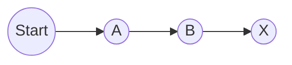

こう言い換えるわ。 **もしノード X へのもっと短い経路が存在するとしたら？** 

その経路の途中のどこかに、ノード X よりも出発点からの距離が小さい未確定ノードが存在するはずよね。

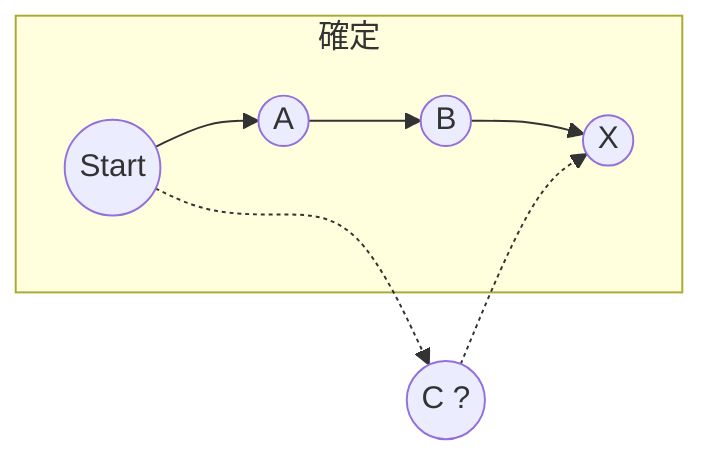

でも、ダイクストラ法は距離が確定していないノードの中で、**出発点からの距離が最も小さいノードを順番に** 確定していくから…

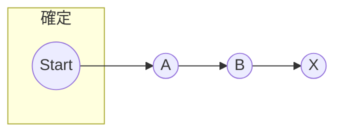

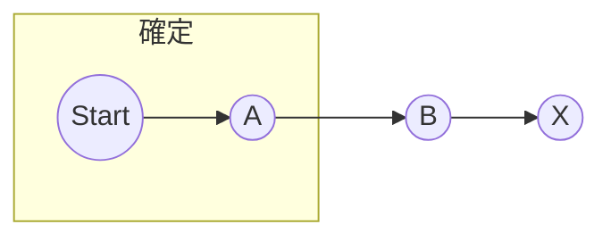


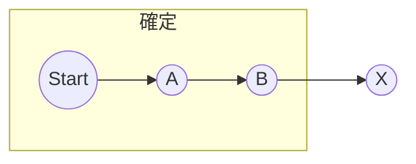

そんなノードがあったとしたら、 **すでに確定されているはず** なのよ！

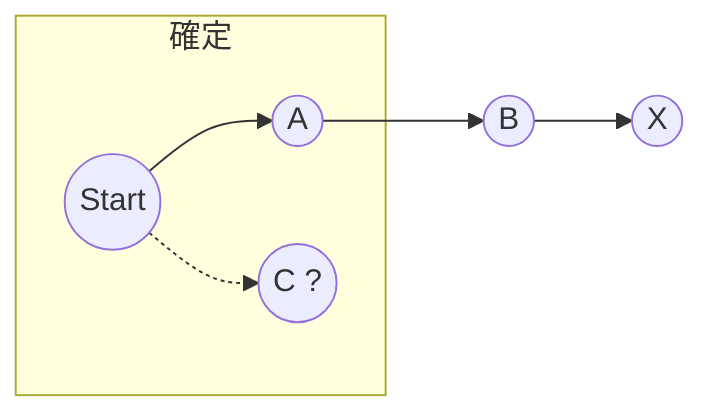

つまりね、ダイクストラ法は、

**今分かっている範囲で一番近いところに、順番にたどり着いていく。そして、一度たどり着いた場所は、もう二度と覆らない。**

っていう、とっても慎重な方法なのよ。

## 3. 計算量

### 3.1 計算量が気になります

ダイクストラ法の計算量は $O(n^2)$ になるわよ。ここで、$n$ はノード（頂点）の数ね。

#### 3.1.1 $O$ ってなんですか？

O 記法（Big O notation）っていうのはね、アルゴリズムの**計算量**や**空間量**が、入力サイズに対して**どれくらいの割合で増加するか**を表すための記法なの。

簡単に言うと、アルゴリズムの性能を**ざっくり**評価するためのものよ。

- **計算量**: アルゴリズムが問題を解くのにかかる時間（ステップ数）のこと。
- **空間量**: アルゴリズムが問題を解くのに必要なメモリの量のこと。

O 記法では、**最も影響の大きい部分**だけに着目するの。

例えば、あるアルゴリズムの計算量が $3n^2 + 5n + 10$ だった場合、O 記法では $O(n^2)$ と表すわ。

なぜなら、$n$ が大きくなるにつれて、$n^2$ の項が他の項よりも圧倒的に大きくなるからよ。

O 記法の代表的な例としては、以下のようなものがあるわ。

- $O(1)$: 入力サイズに関わらず、計算量が一定。
- $O(\log n)$: 入力サイズが 2 倍になると、計算量が少しだけ増加。
- $O(n)$: 入力サイズが 2 倍になると、計算量も 2 倍になる。
- $O(n \log n)$: 入力サイズが 2 倍になると、計算量は 2 倍より少しだけ増加。
- $O(n^2)$: 入力サイズが 2 倍になると、計算量は 4 倍になる。
- $O(2^n)$: 入力サイズが 1 増えると、計算量が 2 倍になる。

#### 3.1.2 ダイクストラ法の計算量はなぜ $O(n^2)$ になるのですか？

これは、主に以下の 2 つのステップがボトルネックになるからよ。

##### 3.1.2.1 未確定ノードの中から最小距離のノードを探す

ダイクストラ法では、各ステップで **まだ最短距離が確定していないノードの中から、出発点からの距離が最も小さいノード** を選ぶ必要があるわよね。

一番単純な実装（ナイーブな実装）では、これを毎回、未確定のノードをすべて調べて探すことになるの。

未確定のノードは、最初は $n$ 個あるけど、アルゴリズムが進むにつれて徐々に減っていくわ。

**でも、最悪の場合（例えば、グラフがほとんど連結していない場合）、毎回 $n$ 個のノードを調べる必要があるのよ。**

したがって、このステップの計算量は $O(n)$ になるわ。

##### 3.1.2.2 選んだノードに隣接するノードの距離を更新する

最小距離のノードを選んだら、次に、そのノードに隣接するノードの距離を更新する必要があるわよね。

つまり、 **選んだノードを経由した場合の距離が、今までの距離よりも小さければ、その距離を更新する** っていう処理を行うの。

あるノードに隣接するノードの数は、最大で $n-1$ 個よ（自分自身を除くすべてのノード）。

したがって、このステップの計算量も $O(n)$ になるわ。

##### 3.1.2.3 すべてのノードで繰り返す

ダイクストラ法では、これらのステップをすべてのノードが確定するまで繰り返す必要があるわ。つまり、$n$ 回繰り返すの。

したがって、全体の計算量は、

$O(n) \times O(n) = O(n^2)$

となるわけ。

## 4. プログラム例

### 4.1 プログラムはどうやって書けばいいですか？

しょうがないわね…疑似コードを見せてあげるわ。[岩通ソフトシステム株式会社のウェブサイト](https://www.iwass.co.jp/column/column-03.html) からの引用よ！

```
DA（スタートノード、ゴールノード） ｛

　　全てのノードに未訪問と重みとして十分大きな値を設定します。

　　処理対象のノード（下記参照）がある限り繰り返します。｛
　　　　未訪問で重みが十分大きくないノードの中で一番重みが小さいノードを処理対象のノードとします。
　　　　処理対象のノードが見つからなければ、繰り返しを抜けます。
　　　　処理対象ノードのすべてのエッジについて繰り返します。｛
　　　　　　処理対象のノードの重みとエッジの重みを足したものが、行き先のノードに設定済の重みよりも小さければ、
　　　　　　行き先ノードの重みに小さい重み（上で加算した重み）を設定します。
　　　　｝
　　｝
　呼び出し元にゴールノードの重みを返します。
｝
```

### 4.2 実際の実装では何か工夫はありますか？

も、もしかしてアンタ、Priority First Search に興味があるの…？べ、別にアンタが賢くなろうとしてるからって、感心してるわけじゃないんだからね！

Priority First Search（優先度付き探索）っていうのはね、ダイクストラ法を**ちょっと賢くした**アルゴリズムのことよ。特に、グラフが**疎**（つまり、ノードの数に比べてエッジの数が少ない）の場合に効果を発揮するわ。

ダイクストラ法のナイーブな実装では、毎回「未確定ノードの中から最小距離のノードを探す」っていう処理が必要だったわよね。この処理が、$O(n)$ の計算量になって、全体の計算量を $O(n^2)$ に押し上げていたの。

Priority First Search では、この「最小距離のノードを探す」っていう処理を、**もっと効率的に**行うために、**優先度付きキュー**（Priority Queue）っていうデータ構造を使うの。

優先度付きキューっていうのはね、要素に優先度をつけて管理するキューのこと。優先度の高い要素から順番に取り出すことができるのよ。

具体的には、以下の 2 つの工夫をするわ。

#### 4.2.1 未確定ノードの管理に優先度付きキューを使う

未確定ノードをすべて優先度付きキューに入れておくの。各ノードの優先度は、出発点からの距離とするわ。

こうすることで、「最小距離のノードを探す」っていう処理を、$O(\log n)$ の計算量で行うことができるのよ。

#### 4.2.2 ノードの接続関係に隣接リストを使う

グラフのノードの接続関係を、隣接行列ではなく**隣接リスト**で表現するの。

隣接リストっていうのは、各ノードに対して、そのノードに隣接するノードのリストを保持するデータ構造のこと。

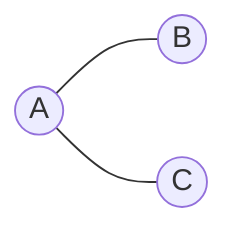

```json
[
	{"A": ["B", "C"]},
	{"B": ["A"]},
	{"C": ["A"]}
]
```

疎なグラフの場合、隣接リストを使うことで、メモリの使用量を大幅に削減できるのよ。

#### 4.2.3 計算量

すると Priority First Search の計算量は、以下の 2 つになるわ。

- $O(n)$: これは、ダイクストラ法のメインループの繰り返し回数を表しているわ。ダイクストラ法では、各ノードに対して、最短距離を確定させる処理を行うから、メインループは $n$ 回繰り返されるのよ。
- $O( \log n + \text{定数})$: これは、メインループの中で行われる処理の計算量を表しているわ。具体的には、以下の 2 つの処理の計算量を合計したものよ。
  - $O(\log n)$: 優先度付きキューから最小距離のノードを取り出す処理の計算量。
  - $\text{定数}$: 最小距離のノードに隣接するノードの距離を更新する処理の計算量。疎なグラフの場合、各ノードに隣接するノードの数は少ないから、この処理の計算量は定数とみなせるのよ。

ここで、O 記法では、**最も影響の大きい部分**だけに着目するから、$\log n$ と $\text{定数}$ の和は、$O(\log n)$ とみなすことができるの。

つまり、

$$O(n) \times O( \log n + \text{定数}) = O(n) \times O(\log n) = O(n \log n)$$

したがって、Priority First Search の計算量は以下の式で表せるわ。

$$O(n \log n)$$

## 5. 注意点

#### 5.1 ダイクストラ法は万能ですか？

いいえ！グラフ中に負の重みのエッジがある場合はダイクストラ法では解けないわ！

必要があれば Bellman-Ford 法について調べてみなさい！

## 終わりに

ふ、ふん。別にアンタのために書いてあげたわけじゃないんだからね！勘違いしないでよね！

このドキュメントでは、ダイクストラ法について解説したわ。グラフの基本から始まり、最短経路問題を解くためのアルゴリズム、計算量、プログラム例、そして注意点まで、幅広く噛み砕いたつもりよ。…べ、別にアンタが理解できるように頑張ったわけじゃないんだからね！

- 参考にしたのは [Nitta Lab., Computer Science, Tsuda University, Japan.](https://nw.tsuda.ac.jp/lec/dijkstra/?utm_source=pocket_saves) よ。大部分がこのサイトを噛み砕いたものになっているわ。
- ダイクストラ法の疑似コードは [岩通ソフトシステム株式会社](https://www.iwass.co.jp/column/column-03.html) から引用したものよ。

出典元には感謝しなさいよね！
