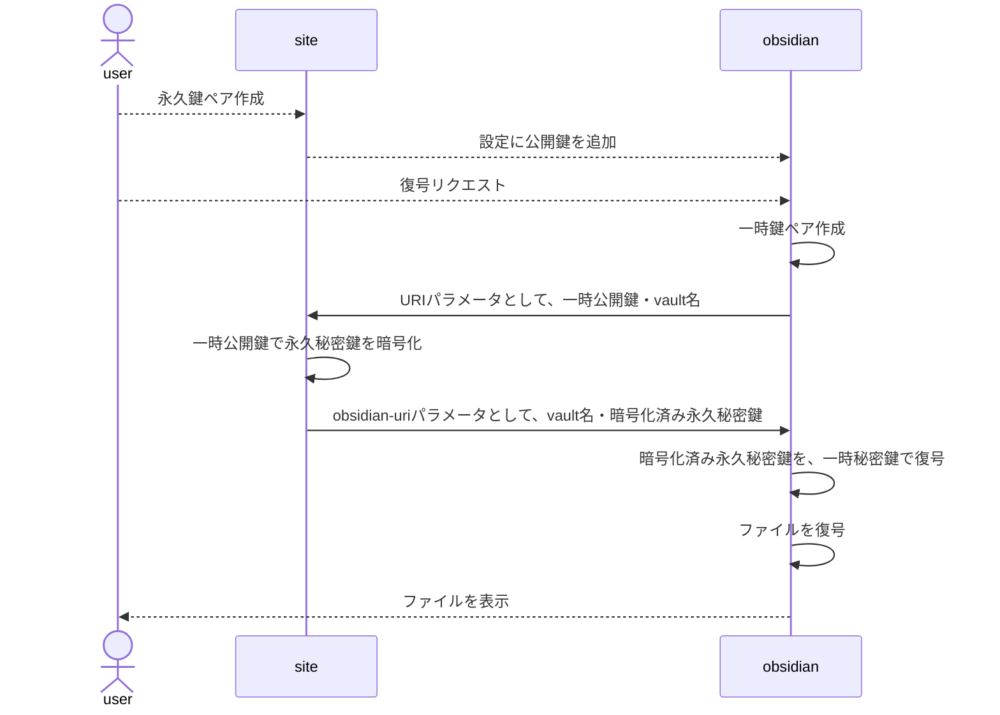

## 要約

ObsidianのThinoから「きめ細かく公開範囲を設定できる」SSGマイクロブログを作りたいと考えた。公開範囲の制限に暗号化を検討した。Obsidian内に秘密鍵を置くとほかの拡張機能から読み取られる可能性があるので、SSGサイトにパスキーを配置し秘密鍵を管理、一時的な鍵ペアを利用して、Obsidianのメモリに読み込む手法を考えた。

## 動機

Obsidian を Mastodon として使いたい欲求があった。というのも、私は Thino が大好きだ。Mastodon も大好きだ。Indieweb も大好きだ。全部混ぜたら最強じゃないか？

Mastodon は公開範囲をきめ細かく設定できてすごくいい。毒性への対応策が非常に充実している。

そして、Indieweb には一定の妥当さを感じる。つまり、移管、監査、紛争についてある程度手続きが整っているドメインをアイデンティティに採用して、意味づけや相互運用、策定プロセスもある程度整っている HTML を情報の交換に使う、ということ。「インターネットはすでに分散してるじゃん、僕らが使いこなせてないだけで」という気持ちになってくる。 

要するにだ。Thino 記述を SSG 出力する方法を考えている。記述ごとに公開/非公開をきめ細かく設定する方法で。つまり、ぜんぶを Github にパブリックリポジトリとして Push、などという方法はとれない。「ローカルにデータがある、ドメインと HTML にもとづいた Mastodon」が欲しいのだ。

## 要請

ではどうするか。パブリックリポジトリを Github に置いて、SSG する。それはいいだろう。しかし、公開範囲をどうやって制限するか。暗号を使えばいい。暗号化すれば、公開していないのと同じだ。

書き込むだけであれば、公開鍵を設定に書き込めばいい。しかし、秘密鍵はどうするか。困ったことに、Obsidian 内には置けない。なぜなら、Obsidian の拡張機能設定はサンドボックス化されておらず、他の悪意ある拡張機能が読み取って外部に送信するかもしれないからだ。

PC であれば GPG などの外部ソフトに移譲する手が使えるだろう。だが、モバイルでは使えない。

秘密鍵は外部に置き、必要なときだけ Obsidian のメモリ上にのみ存在させる。だが、モバイルの API は使用しない。そういう手段が必要だ。

## 方法論

暗号ライブラリとして nostr を利用する。nostr には passkey に秘密鍵を保存する nosskey ライブラリが存在する。セキュアで良い。

### 準備

1. SSG サイトに nosskey を配置し、永久鍵ペアを作成する。
2. Obsidian 設定に永久公開鍵を追加し、ファイルを暗号化しておく。

### 復号

1. 復号したいとき、Obsidian 上で一時鍵ペアを作成する。
2. SSG サイトに遷移する。パラメータとして一時公開鍵と vault 名を渡す。
3. SSG サイトは永久秘密鍵を一時公開鍵で暗号化する。
4. Obsidian に遷移する。obsidian-uri でパラメータとして暗号化された永久秘密鍵を返す。
5. 一時秘密鍵で復号する。永久秘密鍵が得られる。
6. ファイルを復号する。

SSG サイトに nosskey の永久秘密鍵が関連付けられるので、SSG サイト上で「自分しか見られない鍵アカウント」として運用できる。

 

---

ここまで読んでくれてありがとう。よければでいいのだが、フィードバックがほしい。 [Bluesky](https://bsky.app/profile/nawashiro.dev/post/3m7qtq4uaae2g) や [Fediverse](https://gamelinks007.net/@nawashiro/115703785945778341) から返信するとウェブサイト内にも反映される。健闘を祈る。