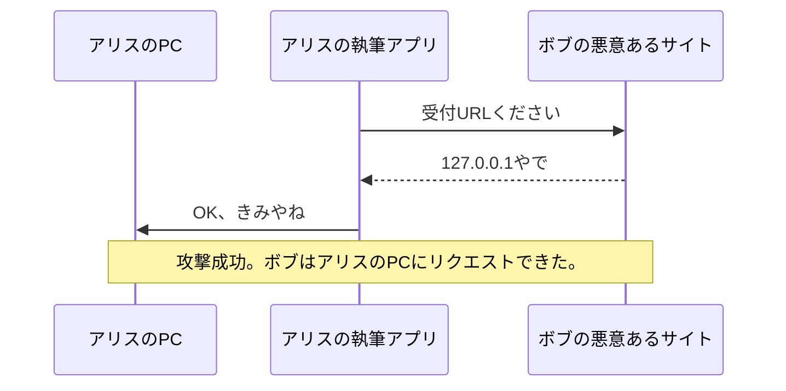

- categories:
	- [🔧技術](categories-develops.md)
- tags:
	- [🏷️ワールドワイドウェブ](tags-www.md)
	- [🏷️なわしろのWWW入門](tags-nawashiro-s-introduction-to-the-world-wide-web.md)
- topics
	- [インディーウェブな個人サイトをSNSで共有する](20250709-share-your-indie-web-personal-website-on-social-media.md)

---

[](https://brid.gy/publish/bluesky) [](https://brid.gy/publish/mastodon)

<p class="e-bridgy-mastodon-content e-bridgy-bluesky-content p-summary">知らないセキュリティ対策があったので、AI に教えてもらった。</p>

## TOC

## なわしろ: 知らない対策をしている

### ハロー、ナビ。Webmention をくれた人の記事を読んでいるよ。

[Webmention を実装した - 春告げ抹茶ホイップ](https://strata.orito-itsuki.graphics/implement-webmention/)

これを読んでいるのだけど、 

> あとは実装で気にしたことというと、個人のローカルで動いているマシンから Webmention を送りつける形になっているので送信先の Webmention の受付先については注意しているつもり。例えば Webmention の受付先としてローカル IP とか私の家庭内ネットワークのアドレスを指す形にした悪意あるページを公開して、私がそれと知らずにリンクしたりした場合、外部の人が私のローカル内部でのリクエストを投げられることになってしまう。  

ここがよくわからない。そうかしら…？ってかんじ。

### ただ、思い当たることがある。

歴戦の 2 ちゃんねらーから聞いた、大事な礼儀作法だ。

> このクソの詰まったアホンダラめ！IP を晒しやがれ！
> 
> （発話者は [DoS 攻撃](https://wa3.i-3-i.info/word11006.html) を試みている）

これを言われたら `127.0.0.1` と話しかけてあげようね、と教わった。すると相手は [我に返って静かになる](https://wa3.i-3-i.info/word17065.html) らしい。

## ナビ: SSRF 攻撃への対策だね

### 正確にはこう読むと腑に落ちると思う。

> 外部の人が、私の執筆アプリを誘導して、私の PC や家庭内ネットワークへ HTTP リクエストを送らせることができてしまう。  

記事の続きにある **「名前解決した IP を検査して、その IP に接続先を固定する」** も、この問題への対策として有効だよ。

### 著者の懸念は筋が通ってる。

ただ **誰のマシンがそのアドレスへ接続するのか** が省略されていて、わかりにくいんだと思う。  

なわしろが挙げた localhost の昔話と、アドレスの仕組み自体は同じ。違うのは、接続する役を誰にやらせるかだよ。  

### 外のページが、内側への接続先を指定できる。

記事では、Webmention を送るのは公開サイトのサーバーではなく、**著者の手元で動くブログ執筆アプリ**なんだって。  

Webmention は、リンク先のページを読んで **受付 URL** を探し、そこへ通知を送る。その受付 URL は、リンク先の運営者が指定できる。  

たとえば、悪意ある公開ページにこんな指定があったとする。  

```html:すごく悪意あるサイト.html
<link rel="webmention" href="http://127.0.0.1:8080/">
```

  無対策の執筆アプリがこれを信用すると、  

- 著者が、その公開ページにリンクした記事を書く。  
- 著者の執筆アプリが、そのページから受付 URL を見つける。  
- **著者の執筆アプリが、著者自身の PC の** `127.0.0.1:8080` **に POST する。**  

という流れになる。`127.0.0.1` はプログラムが動いている環境自身を指す。だからこの場合、著者の PC に接続する。



同じように受付 URL を `http://192.168.1.1/…` にすれば、著者の家庭内ネットワーク機器に接続を誘導できる。  

### SSRF 攻撃にあたる。

**外から内部に直接侵入するのではなく、内側にいるアプリを、外の人が接続の使い走りにする**わけ。これが [サーバ側リクエスト偽造攻撃（Server-Side Request Forgery）](https://developer.mozilla.org/ja/docs/Web/Security/Attacks/SSRF) だよ。今回は送信役がローカルアプリなので、名前の Server-Side はちょっと紛らわしいけど。  

### ただし「リクエストできる」と「乗っ取れる」は別。

ここは区別したほうがいい。  

Webmention の送信であれば、基本的には執筆アプリが決めた内容で POST するだろうから、**何でも自由に操作できるわけではないよ**。

```bash:執筆アプリが送るPOST
curl -i 'http://127.0.0.1:8080/' \
    --data-urlencode 'source=https://alice.example/posts/hello' \
    --data-urlencode 'target=https://bob.example/posts/world'
# 返事: 接続に失敗しました。相手は、電波の届かないところにいるか、電源が入っていないか、話したくありません。
```

でも、ローカルや LAN 内からの接続を信用して認証を省いているサービスなどがあれば、問題になる可能性がある。**攻撃者がふつうは届かない場所へ、うっかり届いてしまうこと自体が、避けたいライン越え**なんだよね。  

```bash:執筆アプリが送るPOST
curl -i 'http://192.168.1.1:1234/' \
    --data-urlencode 'source=https://alice.example/posts/hello' \
    --data-urlencode 'target=https://bob.example/posts/world'
# 返事: わかりました。いますぐ5千兆円振り込みます。ついでに実印もあげます。
```

## なわしろ: はえーすっごい

気にしたことなかったよ。私は横着＆個別手動送信のために [webmention.app](https://webmention.app) を使っていたんだ。ググるとクラウド怖い話がいっぱい出てくるね。

---

[Bluesky](https://bsky.app/profile/nawashiro.dev/post/3mwpswtjrct2i) か [Fediverse](https://gamelinks007.net/@nawashiro/117358803243365974) から返信して会話に参加してください。